# Auctorio SEO Engine V2 — Architecture & Operator Notes (M16–M22)

Updated 2026-08-25 · commits `f027ce5..4d77e9c` · see `MILESTONES.md` for evidence.

## Old pipeline vs new pipeline

**Before:** date + site + objective + topics → free-form LLM JSON (parse, fail)
→ plan rows with title/keyword only → generic 2000-word generation → raw
textarea editing → shallow SEO tab → publisher.

**After:**

```mermaid
flowchart LR
  A[Website Intelligence<br/>sitemaps + crawl + profile] --> B[Content Inventory<br/>indexed pages + clusters + links]
  B --> C[Topic & Search Strategy<br/>relevance + cannibalization + search targets]
  C --> D[Editorial Planning<br/>schema-validated structured briefs]
  D --> E[Approved SEO Brief]
  E --> F[Evidence-Grounded Generation<br/>intent-aware profiles + word targets]
  F --> G[Professional Rich Editing<br/>au-rich-editor]
  G --> H[SEO QA V2<br/>explainable score + findings]
  H --> I[Editorial Approval<br/>review gate]
  I --> J[Destination-Aware Publishing<br/>GuiaTV / Tecnoria adapters]
  J --> K[Measurement / Refresh<br/>incremental re-index]
```

## Site intelligence architecture

- `src/studio/site-intelligence/sitemap.ts` — candidate discovery
  (`/sitemap.xml`, `/sitemap_index.xml`, `robots.txt` `Sitemap:` lines),
  bounded recursion (depth 3, 5000 URLs, 2 MB sitemap cap), dedupe, cross-origin
  blocking, per-sitemap health recording.
- `src/studio/site-intelligence/crawler.ts` — SSRF-safe page fetch
  (`validateScrapeUrl`), boilerplate removal, extraction of canonical/title/
  meta/H1/headings/clean content/word count/dates/JSON-LD/OG/internal links;
  content-hash change detection; `SITE_INTEL_*` env tunables (budget, byte caps,
  min words).
- `src/studio/site-intelligence/profile.ts` — deterministic synthesis:
  language, content types, keyword/topic extraction with Spanish stopwords,
  GuiaTV platform/sports/commercial/evergreen/news lexicons, clusters by
  content type with authority scores, median article length, internal-link
  targets, crawl health, confidence and warnings. No LLM required.
- `src/studio/site-intelligence/index.ts` — `refreshSiteIntelligence()`:
  discovery → inventory upsert → bounded crawl → profile rebuild, with a
  per-site in-flight lock, structured events and audit logs.
- Persistence: `site_sitemaps`, `site_indexed_pages`, `site_topic_clusters`,
  `site_entities`, `site_internal_links`, `site_intelligence_profiles`,
  `search_targets` (migration `20260825000000_site_intelligence`, additive).
- API: `GET /v2/site-intelligence/:siteId`, `POST …/index` (background-safe,
  `wait=true` for sync runs), `GET …/pages`.
- Performance budget: planner context assembly p95 < 1.5 s (observed ~100 ms);
  normal plan requests never trigger a crawl; indexing is incremental.

## Editorial planning architecture

- `src/studio/editorial-plan-schema.ts` — `EditorialPlanGenerationSchemaV2`
  (prompt v2.1): full SEO brief schema with enum-validated intents, content
  formats, funnel stages and per-format word targets.
- `src/studio/editorial-plan-context.ts` — `buildEditorialPlanningContext(siteId)`:
  compact, ranked, site-scoped evidence (profile, top indexed pages, search
  targets, existing plans/projects, sources, allowed evidence URLs).
- `src/studio/site-relevance.ts` — deterministic 0–100 relevance scoring with a
  hard off-topic lexicon, topic overlap, TV-domain affinity, sports affinity,
  cluster fit, strategy-format allowance, intent fit and query fit; threshold
  45. Cannibalization classifier: `none | related-cluster | update-existing |
  merge-candidate | high`.
- `src/studio/editorial-plan.ts` — post-validation (app owns dates, enums,
  duplicates, internal-link inventory, evidence whitelist, quantity, word
  targets), batched generation (2 items/call, maxTokens 3000, maxAttempts 3,
  temperature 0.5), truncation retries, exact + near-duplicate detection
  (token overlap ≥ 0.75), bounded top-up rounds, chunk failure tolerance, and
  background execution (`enqueueEditorialPlanGeneration`) with plan polling.
- Persistence: plan rows + `editorial_plan_generation_attempts` (provider,
  model, attempt, finish reason, token usage, schema validation, repair/retry
  flags).

## AI structured-output architecture

- `src/infrastructure/ai/structured.ts` — `generateStructured<T>(schema)`:
  provider-native JSON mode → safe extraction → controlled repair → strict
  schema validation → one corrective retry with validation errors → typed
  `StructuredOutputError`. `finish_reason=length` triggers a compactness
  retry instead of trusting repaired-truncated payloads.
- Provider plumbing stays in the AI layer; business logic never parses
  provider-specific formats. Observability events per attempt
  (`ai.structured.completed|retry|failed`, `editorial_plan.*`).

## Publishing contract (GuiaTV)

- `src/studio/publishers.ts` GuiaTvPublisher maps from project metadata:
  `contentType`, `primaryIntent`, `targetQuery`, `relatedPlatformKeys`,
  `relatedRouteKeys`, `faqItems`, `evergreen`, `metaTitle`, `metaDescription`,
  `keywords`, `canonicalUrl`, images, `featured`. Editor/SEO workspace
  populate these from the approved brief.
- HTML is allowlist-sanitized; headings/strong/em/lists/links/tables survive.
- Draft publications terminate in `draft_synced`; live publishes in
  `published`. Approval gate (version approve) is required before publishing.

## External provider requirements

- **Mandatory (planning/generation)**: DeepSeek-compatible text API
  (`TEXT_PROVIDER`, `TEXT_API_BASE_URL`, `TEXT_API_KEY`, `TEXT_MODEL`) —
  configured in production.
- **Optional (destination indexing)**: none — Auctorio crawls connected sites
  directly (SSRF-safe). Firecrawl/Tavily remain optional for external AI
  source search and are reported honestly when unconfigured.
- **Optional (social)**: X/Meta/Ayrshare credentials.

## Operator runbook

- Deploy: `npm run typecheck && npm run build && npx prisma migrate deploy` →
  restart ALL `content-ai-*` services (workers run QA and generation; API-only
  restarts leave stale worker code).
- Index a site: Studio → Connections → Site Intelligence → Index; or
  `POST /v2/site-intelligence/:siteId/index` (`wait=true` for synchronous
  runs, budget ≤ 500).
- Plan generation: `POST /v2/editorial-plans/generate` with `async: true`
  (default) → poll `GET /v2/editorial-plans/:id` until `ready|failed`.
  Friendly failures map `EDITORIAL_PLAN_STRUCTURED_OUTPUT_INVALID`,
  `EDITORIAL_PLAN_NO_RELEVANT_ITEMS`, `site_intelligence_required`.
- Rollback: migrations are additive (zero drops); previous Studio releases
  retained under `apps/studio-web/releases/`; DB backups via
  `/etc/cron.d/auctorio-backup`.
